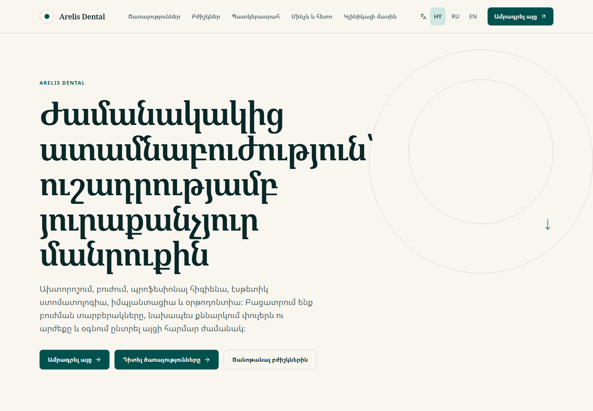
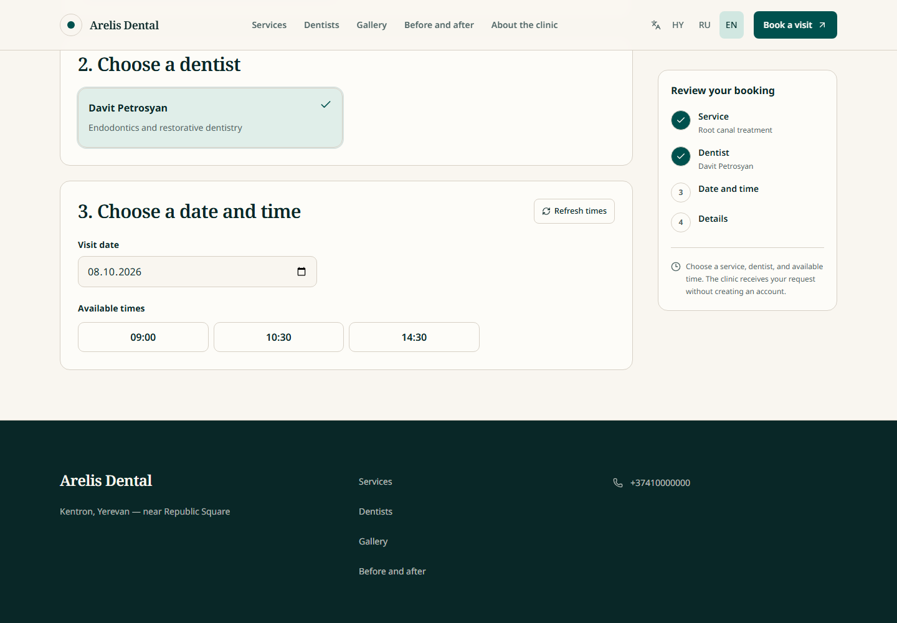
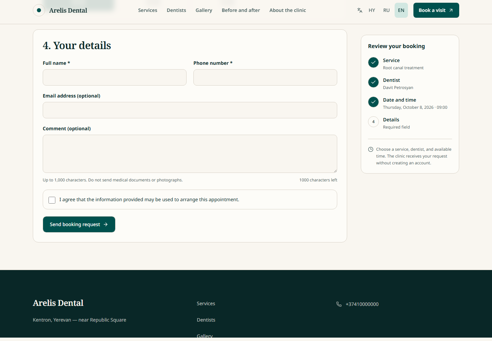
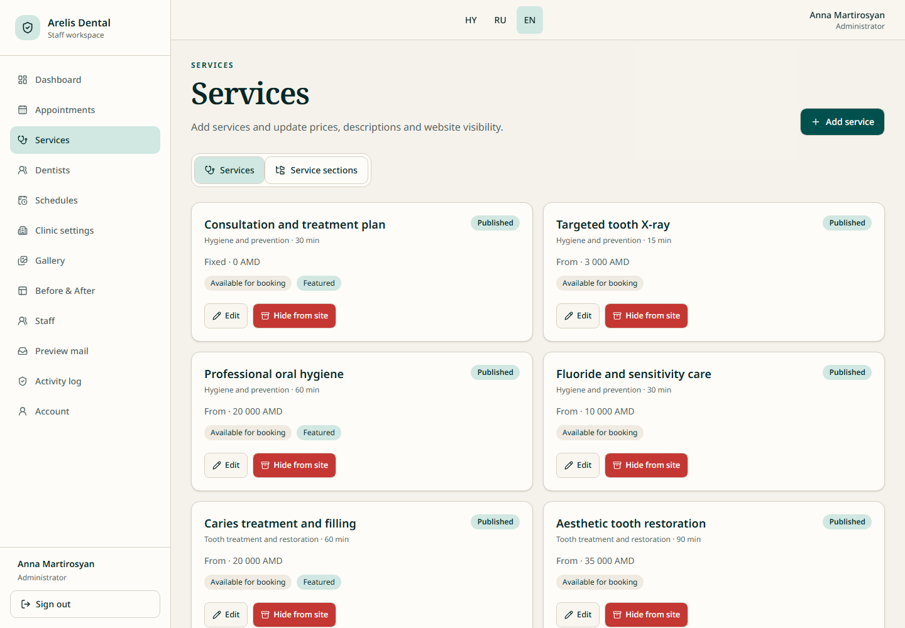
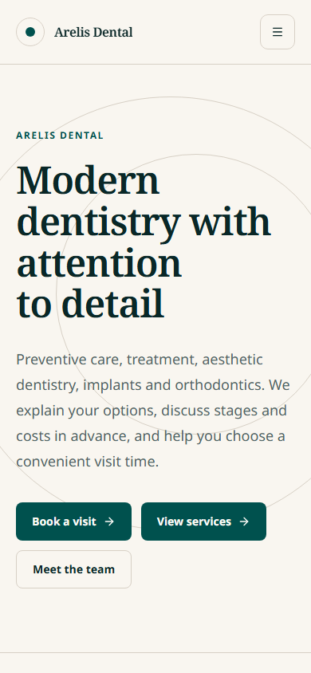
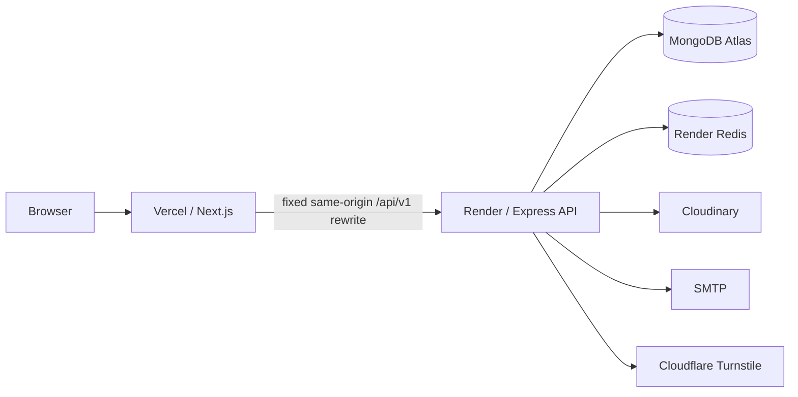

# Arelis Dental

Multilingual full-stack dental clinic platform with online booking, role-based staff workspaces, governed media, and production-oriented infrastructure.

[](https://github.com/sargisovsepyan/dental-clinic/actions/workflows/backend-ci.yml)
[](https://github.com/sargisovsepyan/dental-clinic/actions/workflows/frontend-ci.yml)
[](https://github.com/sargisovsepyan/dental-clinic/actions/workflows/codeql.yml)

[Live application](https://arelis-dental.vercel.app) · [Backend service](https://arelis-api.onrender.com) · [API readiness](https://arelis-api.onrender.com/api/v1/health/ready) · [OpenAPI contract](docs/openapi.yaml)

## Overview

Arelis Dental is a deployed portfolio application for a fictional dental clinic. It combines a localized public website and no-account booking journey with protected operational workspaces for administrators, receptionists, and dentists. The system is deliberately scoped to clinic marketing, booking, media, and staff operations—it is not an electronic health record or medical-record system.

Armenian is the primary publication language, with explicitly authored Russian and English routes. The frontend runs on Vercel; its fixed same-origin `/api/v1` route forwards to the Express API on Render while preserving strict cookies and Origin validation.

## Product highlights

### Public experience

- HY / RU / EN clinic, services, dentists, gallery, and consent-approved before/after pages
- live availability and no-account appointment requests
- service and dentist preselection with clinic-timezone scheduling
- Cloudflare Turnstile protection and accessible responsive layouts
- privacy-minimized confirmation states with no patient data in URLs or browser storage

### Staff operations

- administrator and receptionist appointment workflows, including creation, status changes, rescheduling, and cancellation
- dentist workspace with privacy-scoped, read-only access to assigned appointments
- admin management for clinic content, services, dentists, schedules, gallery media, and before/after governance
- staff invitations, setup, password recovery/change, activation, role management, session revocation, and audit history
- explicit consent withdrawal/purge flows and durable media-cleanup visibility

### Engineering controls

- rotating refresh sessions, memory-only access tokens, RBAC, and current-database authorization checks
- booking idempotency, atomic phone quotas, optimistic mutation versions, and database-enforced exact/overlapping slot locks
- transaction-safe rescheduling and cancellation with lock preservation/release guarantees
- explicit migrations, non-dropping index management, production preflight, liveness, readiness, and graceful shutdown
- isolated backend integration/concurrency coverage, frontend unit/component coverage, Chromium Playwright, targeted WebKit/iPhone regression coverage, and CodeQL

## Screenshots

All screenshots below use fictional data from the provider-free local preview.

<table>
  <tr>
    <td></td>
    <td></td>
  </tr>
  <tr>
    <td align="center"><sub>Localized public homepage</sub></td>
    <td align="center"><sub>Online booking with live availability</sub></td>
  </tr>
  <tr>
    <td></td>
    <td></td>
  </tr>
  <tr>
    <td align="center"><sub>Booking details and review state</sub></td>
    <td align="center"><sub>Role-aware staff workspace</sub></td>
  </tr>
</table>

<p align="center">
  
  <br />
  <sub>Responsive mobile experience</sub>
</p>

## Roles and access

| Role | Primary capabilities |
| --- | --- |
| Administrator | Appointments, catalog, dentists, schedules, clinic settings, governed media/consent, staff, and audit history |
| Receptionist | Operational appointment creation and management without administrative configuration access |
| Dentist | Read-only, privacy-scoped access to appointments assigned to the linked dentist profile |

Frontend navigation is convenience and defense in depth; the API independently authorizes every protected operation.

## Tech stack

| Layer | Technologies |
| --- | --- |
| Frontend | Next.js 16, React 19, TypeScript, Tailwind CSS, Base UI |
| Backend | Node.js 22+, Express 5, Mongoose |
| Data and infrastructure | MongoDB Atlas, Render Redis / Key Value, Cloudinary, SMTP, Cloudflare Turnstile |
| Quality | Node test runner, Vitest, Testing Library, axe-core, Playwright, OpenAPI, Redocly, CodeQL |
| Hosting | Vercel frontend, Render API, GitHub Actions CI |

## Architecture



The public browser API remains on the frontend origin. The upstream is fixed server-side deployment configuration, not a user-selectable proxy. Refresh cookies stay Secure, HttpOnly, host-only, `SameSite=Strict`, and scoped to authentication routes.

## Booking and concurrency

A logical booking attempt receives one idempotency key. An uncertain retry reuses that key, while changed appointment data creates a new attempt. MongoDB owns slot authority through unique minute-level locks that prevent exact and overlapping bookings across processes. Atomic quota records bound public submissions, and versioned appointment mutations reject stale writes.

Rescheduling acquires the replacement authority before releasing the original; a failed move preserves the existing appointment and lock. Cancellation releases booking authority safely. Availability is calculated in the configured clinic timezone from clinic hours, dentist schedules and exceptions, duration, buffers, notice, and booking horizon.

## Security and privacy

- short-lived JWT access tokens with single-use refresh rotation, replay detection, and revocation
- exact-Origin checks, strict cookie policy, fixed proxy trust, CORS/CSP/Helmet controls, and shared Redis rate limits
- server-side input allowlists and production-safe error responses
- upload signature/type/size checks, Cloudinary rollback, reference guards, and cleanup reconciliation
- consent-governed before/after publication with withdrawal and purge boundaries
- sanitized business audit records and structured logs that exclude secrets and patient contact data
- automated tests restricted to disposable local databases and fake/local provider adapters

See the [security model](docs/SECURITY.md) and [retention and privacy decisions](docs/RETENTION_AND_PRIVACY.md) for the full boundaries.

## Testing and CI/CD

GitHub Actions installs from lockfiles and runs separate backend and frontend pipelines plus CodeQL. The repository includes comprehensive backend unit, integration, migration, security, and concurrency tests; frontend component and contract tests; a full Chromium Playwright suite; and targeted WebKit/iPhone regression coverage. Automated tests do not contact production MongoDB, Redis, SMTP, Cloudinary, monitoring, or challenge providers.

Common local quality gates:

```text
cd backend
npm ci
npm run verify
```

```text
cd frontend
npm ci
npm run typecheck
npm run lint
npm run test:coverage
npm run build
npm run test:e2e
```

## Project structure

```text
backend/   Express API, models, services, migrations, workers, and tests
frontend/  Next.js public site, booking flow, staff workspaces, and tests
shared/    Cross-application contract fixtures and schemas
docs/      Current architecture, API, security, and operational documentation
.github/   Backend CI, Frontend CI, CodeQL, and dependency automation
```

## Local development

Use a current supported Node.js release (Node 22.12+ or Node 24). Copy each checked-in example to an untracked local environment file and keep credentials out of Git.

Real local backend:

```text
cd backend
npm ci
# Copy .env.example to .env and provide local-only values.
npm run dev
```

Frontend against that backend:

```text
cd frontend
npm ci
# Copy .env.example to .env.local and use the documented local origins.
npm run api:types
npm run dev
```

For a deterministic, provider-free product tour with fictional content:

```text
cd frontend
npm ci
npm run dev:preview
```

The preview launcher prints its local URLs and demo credentials, keeps all traffic on localhost, and requires no MongoDB, Redis, SMTP, Cloudinary, or Turnstile account. See the [frontend guide](frontend/README.md) for scenarios and detailed commands.

## Environment and deployment

The example environment files are development templates, not production configuration:

- [`backend/.env.example`](backend/.env.example)
- [`frontend/.env.example`](frontend/.env.example)
- [production environment contract](docs/PRODUCTION_ENVIRONMENT.md)

Migrations and production index changes are explicit operator actions and never run automatically at API startup. Use the [deployment architecture](docs/DEPLOYMENT_ARCHITECTURE.md), [production runbook](docs/PRODUCTION_RUNBOOK.md), [operations guide](docs/OPERATIONS.md), and [backup/restore runbook](docs/BACKUP_RESTORE_RUNBOOK.md) for controlled releases.

## API and documentation

The machine-readable contract is [`docs/openapi.yaml`](docs/openapi.yaml); [`docs/API_CONTRACT.md`](docs/API_CONTRACT.md) explains behavioral and concurrency guarantees. The [documentation index](docs/README.md) separates current reference material from historical engineering reports.

## Demo deployment notes

- Render's free tier can cold-start after inactivity, so the first API request may take longer.
- Durable notification-outbox and worker support is implemented, but the free demo does not currently host a separate always-on notification worker.
- Clinic identities, people, appointments, and editorial content shown in the demo are fictional portfolio content.

## Author

**Sargis Hovsepyan** · [GitHub](https://github.com/sargisovsepyan)
